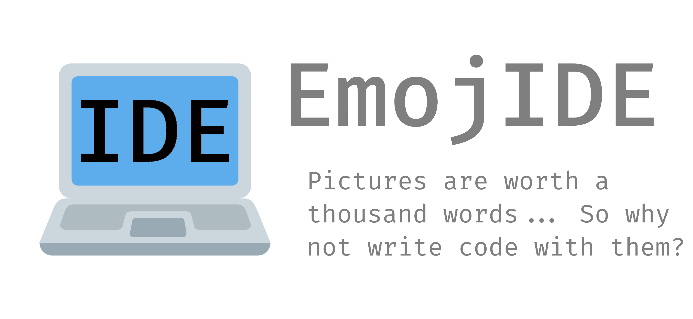

<h1 align="center">
  
  
  
   
</h1>
<h1 align="center">
    
</h1>

  <b>
    <a href="https://github.com/RubbaBoy/EmojIDE/wiki">Features</a> |
    <a href="https://github.com/RubbaBoy/EmojIDE/wiki">Wiki</a> |
    <a href="https://www.reddit.com/user/OnlyTwo_jpg">Reddit</a> |
    <a href="https://www.youtube.com/">Demo</a> |
    <a href="https://www.programmerhumor.org/Hackathon">Hackathon</a>
  </b>

After completing [MS Paint IDE](https://ms-paint-i.de/), I realized that moving from Discord to talk with people all the way to Paint to program was relatively exhausting. I then set to make EmojIDE, an IDE entirely in Discord Emojis. This project strives to increase communication among developers by making Discord the cool to both program in and communicate with other developers.

## Features

EmojIDE is a Discord bot created for the [r/ProgrammerHumor](https://www.reddit.com/r/ProgrammerHumor/) [hackathon](https://www.programmerhumor.org/Hackathon), lasting a month. This means that the bot does currently lack some features revolving around multi-user usage, and I am trying to use the time limit as justification for my lazyness. The current features actually implemented in the bot, however, are:

- 2050+ emojis across 42 Discord servers
  - Including 2 fonts (With expandability) in 8 color variations each
  - Easy inspectability, bulk deletion, and other means of management of emojis
- Never-before-seen I/O, allowing for:
  - No reactions for any primary Emoji I/O
  - A full ANSI keyboard in emojis, with < 1s response time (Not including render engine throttles)
  - Help menus/embeds navigatable via clicking on options
  - Selectable elements of an enum/list via emojis for settings
  - High expandability
- A highly advanced Emoji based rendering framework
  - Highly expandable with little effort
  - Advanced theming capabilities
    - Current themes are EmojIDE and IntelliJ
  - A render engine to handle DIscord API interactions
  - 3 Displayer implementations, allowing for:
    - Normal emoji rendering in a channel
    - Rendering immediatly to an image (As rapid development can be bottlenecked by Discord's rate limiting)
    - Rendering to a local Discord clone for an exact preview immediatly
- Advanced, custom command framework
- Custom event framework
- HSQLDB Integration to store code files
- Execution and full syntax highlighting of JavaScript